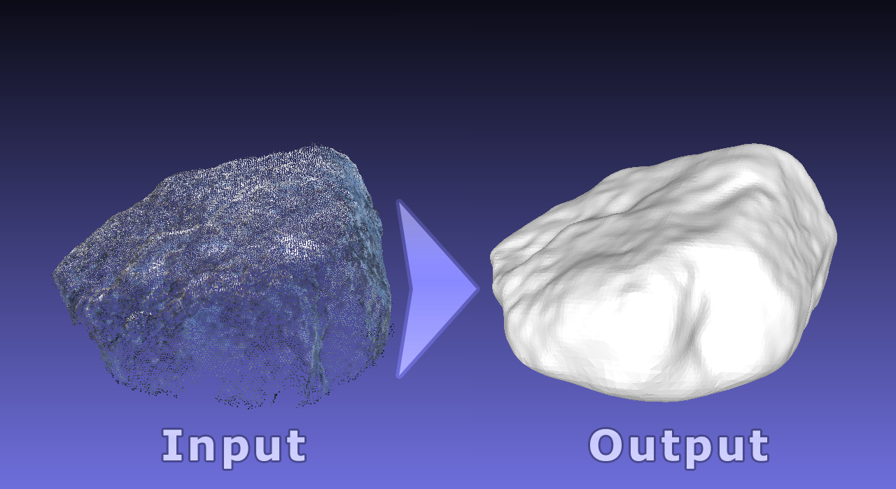
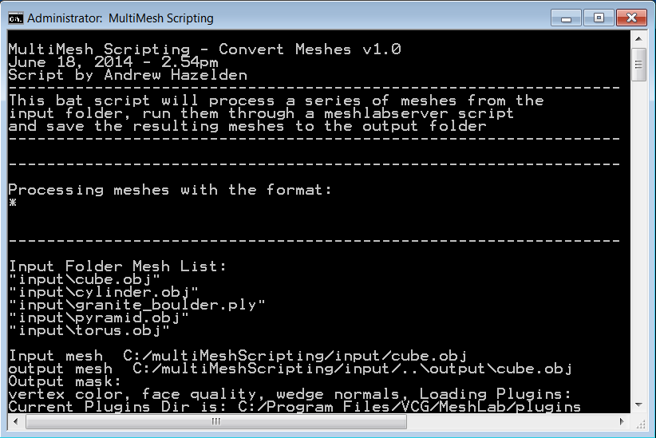
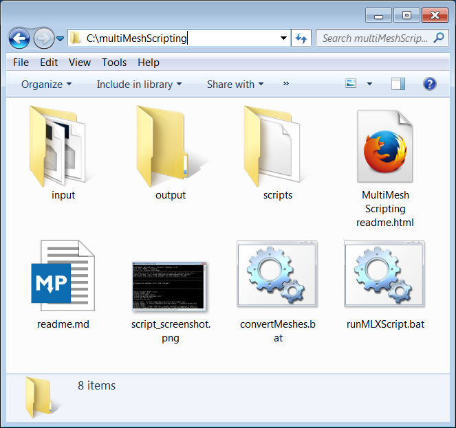

# MultiMesh Scripting v1.0 #
Released June 18, 2014  
by Andrew Hazelden

## Overview ##

The MultiMesh Scripting tool simplifies the process of using meshlabserver on Windows. The scripts provide an easy way to batch covert mesh formats, and creates a standardized method for applying a MeshLab MLX filter script to a folder of laser scan or photogrammetry reconstructed geometry files.

## Download ##

The MultiMesh Scripting .BAT scripts are open source programs that are available as a free download.

This script uses meshlabserver to drive the conversions. To get a copy of meshlabserver you need to download the latest copy of MeshLab (which is free) from VCG:  
[http://meshlab.sourceforge.net/](http://meshlab.sourceforge.net/ "http://meshlab.sourceforge.net/")

## Installation ##

For the MultiMesh Scripting software to work it has to be expanded and moved to the folder:  
> C:\multiMeshScripting

The MultiMesh Scripting scripts expect MeshLab & meshlabserver to be located at:
> C:\Program Files\VCG\MeshLab\meshlabserver.exe

You can edit the two MultiMeshScripting .bat scripts if you installed meshlab to another location on your hard disk.

* * *

## Batch Script Notes ##

I created the following .bat scripts to show what is possible:

**runMLXScript.bat**  
Processes the mesh files in the input folder using meshlabserver and a user defined MLX script

**convertMeshes.bat**  
Converts the meshes in the input folder using a meshlabserver with a user defined output format.

### Changing Input & Output File Names ###

To change the name of the input and output files you can edit the .bat scripts using a plain text editor.

Input Mesh File variables  

> @set inputFolder=input  
> rem Note: You can choose a specific mesh format for input or  
> rem use an asterix for all files in the input meshes folder  
> rem @set inputMeshFormat=obj  
> @set inputMeshFormat=ply  
> rem @set inputMeshFormat=*  

Output Mesh File variables  

> @set outputFolder=output  
> @set outputMeshFormat=obj  
> rem @set outputMeshFormat=ply  
> rem Note: If you use the PLY output format it is saved as a BINARY PLY file  
> rem @set outputMeshFormat=u3d  

MLX script file variables  

> rem the MLX scripts are stored in the C:\multiMeshScripting\scripts folder  
> @set mlxScriptFile=simple_script.mlx  
> @set mlxScriptFolder=scripts  

* * *

eMail: [andrew@andrewhazelden.com](mailto:andrew@andrewhazelden.com)   
Blog: [http://www.andrewhazelden.com](http://www.andrewhazelden.com)  
Twitter: [@andrewhazelden](https://twitter.com/andrewhazelden)  
Google+: [https://plus.google.com/u/0/105694670378845894137](https://plus.google.com/u/0/105694670378845894137)

